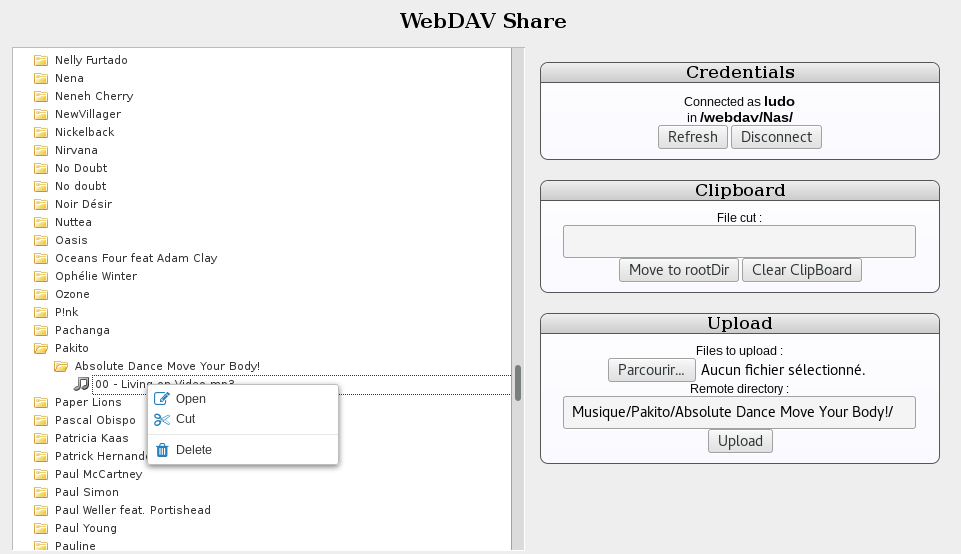

# Reference
[see gitnicolas](https://github.com/gitnicolas/webdavjs)

# Nextcloud tuning
- create a 'webdav' directory in /var/www/html directory of your nextcloud install
- load the content of this git to the 'webdav' directory
- the name of the directory 'webdav' is 'hard coded' cannot be changed unless code is changed
- browse to https://<your server>/webdav/index.html (from a non nextcloud logged fresh session and full url)
- Enter your credentials and you should be able to browse
 
# Changes compared to WebDAVFileTree
- added the "OCS-APIRequest: true" header in the davclient.js (see _getRequest  member)
  - this allows to connect to a nextcloud with a fresh session
  - if you use a session where you have logged to nextcloud, it doesn't work???
- added rootURI to webdavLayer.js in connect member
- modified extractDirContent to detect directories and name correctly the root directory

# To Do
- the idea reusing this code is 
  - to build a file browser for nexcloud webapps
  - to have a javascript API interacting with files
- Should open as a Dialog
- Have to find a way to communicate the selected file with the caller (and filter for files searched)
- Correct this issue for already opened session with nextcloud

# WebDAVFileTree
html and javascript application able to display the content of a remote webdav directory on a html page,
and upload or delete files.

## Description

It's based on several existing tools :
 - jquery.fileTree from Cory LaViska available at http://www.abeautifulsite.net/jquery-file-tree/
(slightly modified to work with a javascript connector instead of a connector on a remote server).
 - jsdavclient, a "Low-level JavaScript WebDAV client implementation written in Javascript" from Sven vogler,
 available at https://github.com/svogler (slightly modified to avoid a compatibilty problem with chrome).
 - jquery.contextmenu : http://swisnl.github.io/jQuery-contextMenu/
 - and, of course, jQuery : https://jquery.com/

## Screenshot

## Compatibilty
### Browsers
Mainly tested on firefox, compatible with chrome and internet explorer 11.

## Webdav server
Tested with a webdav lighttpd server accessed through a apache reverse proxy, both on port 443.
The apache server also host the html pages, so there is no cross domain request from client point of view.

## License
GNU GPL v3 : https://www.gnu.org/licenses/gpl-3.0.html
